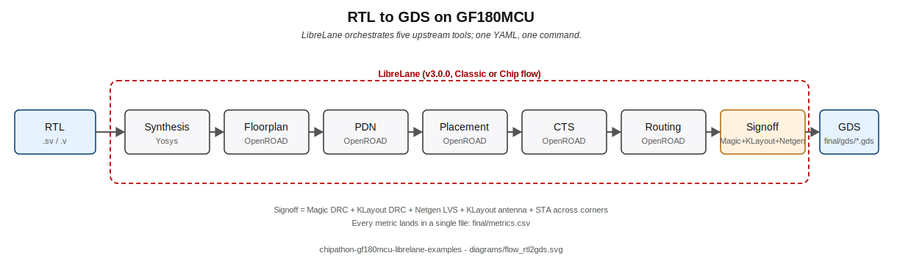
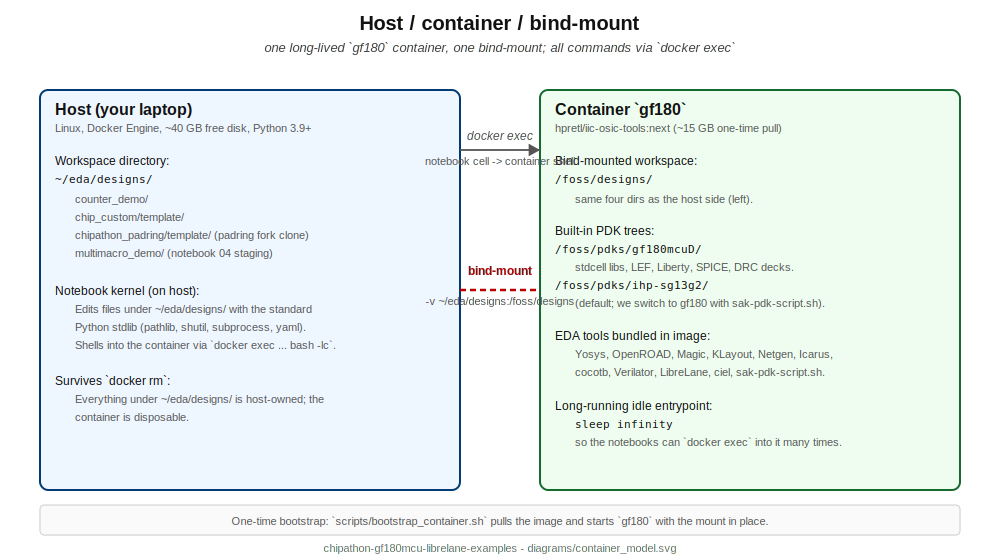
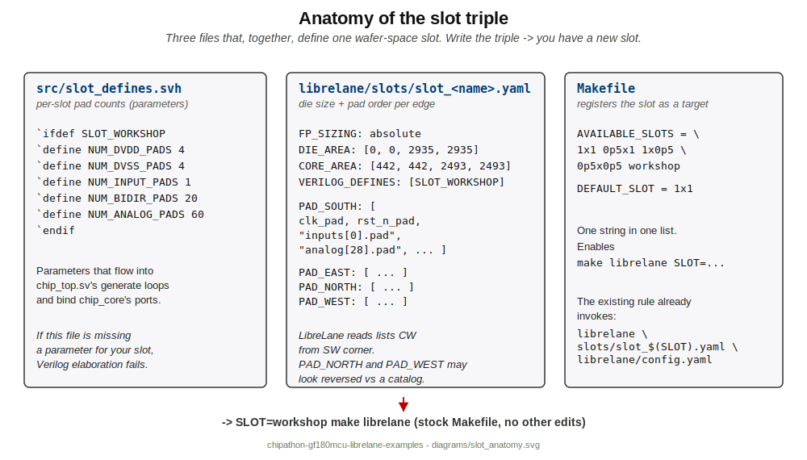

# chipathon-gf180mcu-librelane-examples

Five hands-on Jupyter notebooks that take a chipathon participant from
"I have a tiny piece of Verilog" to "I have a fab-ready GDSII that
respects the workshop padring." Everything runs inside the
`hpretl/iic-osic-tools:next` Docker image; no Nix install required.

The examples are the companion material to the chipathon-2026
workshop padring fork
([`Mauricio-xx/chipathon-2026-gf180mcu-padring`](https://github.com/Mauricio-xx/chipathon-2026-gf180mcu-padring)).

## Credits

- **LibreLane project template + Nix flake + Chip flow:** Leo Moser and
  the wafer-space contributors -- https://github.com/wafer-space/gf180mcu-project-template
- **Workshop pad layout:** Juan Moya -- https://github.com/JuanMoya/padring_gf180
- **Docker image (iic-osic-tools):** IIC / JKU Linz team -- https://github.com/iic-jku/iic-osic-tools

This repository is Apache-2.0 and carries the same attribution chain as
the padring fork. See `NOTICE` and `CREDITS.md`.

## Reading order



| # | Example | What you learn | Runtime |
|---|---------|----------------|---------|
| 00 | [`00_slots_explained.ipynb`](examples/00_slots_explained.ipynb) | What a slot is (and what it is not), the three files that make one. Parses the workshop slot's `slot_defines.svh` to print a side-by-side pad table. | 2 min, read-only |
| 01 | [`01_rtl2gds_counter.ipynb`](examples/01_rtl2gds_counter.ipynb) | Bare 4-bit counter through the LibreLane **Classic** flow. No padring. Standalone (RTL + config inlined). Your smoke test. | 1-2 min flow |
| 02 | [`02_rtl2gds_chip_top_custom.ipynb`](examples/02_rtl2gds_chip_top_custom.ipynb) | Full-chip **Chip** flow on the stock `slot_1x1`, with the counter from #01 hardened as a macro replacing an SRAM. Teaches the hierarchical macro path against the **upstream** template. | 35-45 min |
| 03 | [`03_rtl2gds_chipathon_use.ipynb`](examples/03_rtl2gds_chipathon_use.ipynb) | Clone the padring fork and run *your own* `chip_core.sv` through `SLOT=workshop`. **The notebook you mostly live in during the chipathon.** | 35-45 min |
| 04 | [`04_counter_alu_multimacro/`](examples/04_counter_alu_multimacro/) | Two macros (8-bit counter + 4-bit ALU) hardened independently + **post-synth GL sim** + stitched into the workshop slot. Touches `MACROS:`, `PDN_MACRO_CONNECTIONS:`, and manual floorplan placement. Validated end-to-end 2026-04-25. | ~60-90 min chip-top + ~5 min macros + cocotb |

## Prerequisites

- Linux host, x86_64, ~40 GB free disk.
- Docker Engine (test: `docker ps`).
- Python 3.9+ for the notebook kernel. Stdlib + IPython cover examples
  00-03; example 04 additionally needs `PyYAML` (`pip install pyyaml`)
  for the chip-top patch step.
- One-time: `scripts/bootstrap_container.sh` pulls the image
  (~15 GB) and starts a long-running container called `gf180` with
  the bind-mount `~/eda/designs <-> /foss/designs` in place.



After bootstrap, every notebook `docker exec`s into that `gf180`
container; there's no per-notebook container spin-up.

## Relationship to the padring fork

The chipathon-2026 workshop slot is **not** in this repo. It lives in
the fork:

- https://github.com/Mauricio-xx/chipathon-2026-gf180mcu-padring
  (derivation of wafer-space/gf180mcu-project-template + JuanMoya pad layout)

Notebooks 00, 03 clone the fork on demand under
`~/eda/designs/chipathon_padring/template/`. Notebook 04 uses two
host paths so it never corrupts the baseline shared with notebook 03:

- `~/eda/designs/multimacro_chipathon/template/` -- a **dedicated**
  fork copy where the `MACROS:` + `PDN_MACRO_CONNECTIONS:` patches
  land before the chip-top run.
- `~/eda/designs/multimacro_demo/` -- staging area where the example
  copies its `rtl/`, `tb/` and `librelane/` trees so the container
  sees them under `/foss/designs/multimacro_demo/`.

All fork clones are idempotent: if the path already exists the step
is a no-op.



## Repository layout

```
.
├── README.md                              # this file
├── NOTICE                                 # Apache-2.0 attribution
├── CREDITS.md                             # per-artifact credits
├── AUTHORS.md
├── LICENSE
├── .gitignore
├── diagrams/                              # SVG sources + rendered PNGs
│   ├── flow_rtl2gds.svg
│   ├── slot_anatomy.svg
│   ├── workshop_pad_map.svg
│   ├── multi_macro_hierarchy.svg
│   ├── multi_macro_verification.svg       # example 04 verification chain
│   └── container_model.svg
├── docs/
│   ├── container_setup.md                 # bootstrap, troubleshooting
│   ├── reading_order.md                   # walkthrough summary
│   └── troubleshooting.md
├── examples/
│   ├── 00_slots_explained.ipynb
│   ├── 01_rtl2gds_counter.ipynb
│   ├── 02_rtl2gds_chip_top_custom.ipynb
│   ├── 03_rtl2gds_chipathon_use.ipynb
│   └── 04_counter_alu_multimacro/
│       ├── README.md
│       ├── 04_counter_alu_multimacro.ipynb
│       ├── rtl/
│       │   ├── counter.sv
│       │   ├── alu.sv
│       │   ├── alu_macro.sv
│       │   └── chip_core_multi.sv
│       ├── tb/
│       │   ├── Makefile                    # RTL + GL sim dispatcher
│       │   ├── Makefile.cocotb
│       │   ├── timescale.v                 # 1ns/1ps for GL sim
│       │   ├── test_counter.py             # RTL + GL (same TB)
│       │   ├── test_alu.py                 # pure-comb ALU RTL
│       │   └── test_alu_macro.py           # registered wrapper GL
│       └── librelane/
│           ├── counter_macro.yaml
│           ├── alu_macro.yaml
│           └── chip_top_multi_patch.yaml
└── scripts/
    ├── bootstrap_container.sh             # pull + run gf180
    └── verify_prereqs.sh                  # sanity checks before you start
```

## Quickstart

```bash
# 1. Clone this repo.
git clone https://github.com/Mauricio-xx/chipathon-gf180mcu-librelane-examples.git
cd chipathon-gf180mcu-librelane-examples

# 2. One-time container bootstrap.
scripts/bootstrap_container.sh        # pull + start `gf180`

# 3. Sanity-check the environment.
scripts/verify_prereqs.sh

# 4. Open the notebooks.
jupyter lab examples/00_slots_explained.ipynb
```

All notebooks default their `RUN_*` flags to `False` so the first pass
through every cell only prints the commands. Flip each flag once you
are ready to commit to the (sometimes hours-long) step.

## Experimental tutorials (eda-agents)

> Optional, AI-driven offshoots — **not part of the chipathon tapeout signoff path**.

The [`tutorials/`](tutorials/) subtree shows three ways to drive the **same** 4-bit counter from `examples/01_*` through an LLM agent:

| # | Tutorial | What it demonstrates |
|---|----------|----------------------|
| 01 | [`01_counter_with_agent_tui/`](tutorials/01_counter_with_agent_tui/) | Conversational: open Claude Code or opencode, ask the `gf180-docker-digital` agent to harden the counter. |
| 02 | [`02_counter_python_api/`](tutorials/02_counter_python_api/) | Programmatic: ~30 lines of Python via `GenericDesign` + `ProjectManager`. |
| 03 | [`03_counter_autoresearch/`](tutorials/03_counter_autoresearch/) | Greedy AI loop pareto-optimises QoR knobs (density, clock period, PDN width) under a $0.30 budget cap. |

All three depend on the [`eda-agents`](https://github.com/Mauricio-xx/eda-agents) Python package. Read [`tutorials/README.md`](tutorials/README.md) and [`tutorials/docs/eda_agents_setup.md`](tutorials/docs/eda_agents_setup.md) before opening any of them.

For chipathon **tapeout**, stick with `examples/`. The tutorials are for *learning the agentic flow*.

## License

Apache-2.0. See `LICENSE`, `NOTICE`, `CREDITS.md`, `AUTHORS.md`.
