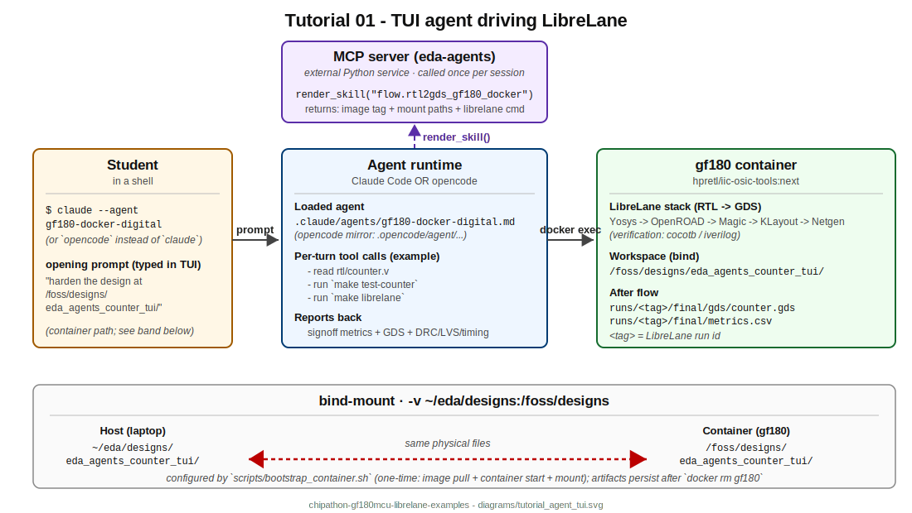

# Tutorial 01 — Counter with TUI agent (Claude Code / opencode)

> **EXPERIMENTAL.** Agent-driven walkthrough on top of the `eda-agents` package. Not part of the chipathon tapeout signoff path. For tapeout work stay with `examples/`.



This tutorial shows how to harden the same 4-bit counter from `examples/01_rtl2gds_counter.ipynb` by **chatting with an LLM agent** instead of running the LibreLane commands yourself. The agent (`gf180-docker-digital`, shipped by `eda-agents`) loads its playbook from the `flow.rtl2gds_gf180_docker` skill via MCP, asks you for approval at each big step, and surfaces the signoff metrics at the end.

## Files

```
01_counter_with_agent_tui/
├── 01_counter_with_agent_tui.ipynb    # orchestrator: stage workspace, print agent invocations, verify metrics
├── README.md                           # this file
├── docs/
│   └── agent_walkthrough.md            # what to expect at each agent turn
├── rtl/
│   └── counter.v                       # 4-bit synchronous up-counter (active-high reset)
├── tb/
│   ├── Makefile                        # cocotb dispatcher (RTL sim only)
│   ├── Makefile.cocotb                 # standard cocotb include
│   └── test_counter.py                 # 3 cocotb tests: reset, increment, wrap
└── librelane/
    └── config.yaml                     # GF180MCU Classic flow config (300x300 um die)
```

## What this tutorial demonstrates

- **Agent + skill model.** The `gf180-docker-digital` agent definition is a thin Markdown file that loads the `flow.rtl2gds_gf180_docker` skill from the eda-agents MCP server. The skill carries the actual procedure (image tags, mount paths, `make librelane` command, signoff parsing). The agent is the conversational interface; the skill is the reference.
- **Approval-gated execution.** Both Claude Code and opencode prompt for permission before each tool call. You see what the agent is about to do before it runs.
- **One agent, two CLIs.** The same `.md` file under `eda-agents/.claude/agents/` and `eda-agents/.opencode/agent/` produces identical behaviour in both runtimes. Use whichever CLI you have installed.
- **Notebook as scaffold.** The `.ipynb` only does the boring parts (path guard, staging, metrics check). The interesting work happens in the chat.

## Running the example

1. Ensure the one-time setup is done — see [`../docs/eda_agents_setup.md`](../docs/eda_agents_setup.md). You need: the `gf180` container running, `eda-agents` installed in a venv, Claude Code or opencode on PATH, and `eda-init` run from the repo root.
2. Open this notebook:
   ```bash
   jupyter lab tutorials/01_counter_with_agent_tui/01_counter_with_agent_tui.ipynb
   ```
3. Step through cells 0-3. They check pre-conditions, stage `~/eda/designs/eda_agents_counter_tui/`, and (optionally) run a 10-second cocotb sanity check.
4. Cell 4 prints two terminal commands. Pick one, paste it in a **new terminal**, and start chatting with the agent.
5. Wait ~10-15 minutes while the agent walks the flow. See [`docs/agent_walkthrough.md`](docs/agent_walkthrough.md) for what each agent turn looks like.
6. After the agent reports success, return to the notebook, flip `RUN_METRICS_CHECK=True` in cell 0, and run cell 5 to assert the signoff numbers.

## Step-by-step runtime estimate

| Step | Time | What runs |
|------|------|-----------|
| 0 (config + path guard) | <1s | pure Python |
| 1 (pre-flight) | ~2s | `docker ps`, `which`, `import eda_agents` |
| 2 (stage workspace) | <1s | `shutil.copytree` x3 |
| 3 (cocotb sanity) | ~10s | `docker exec gf180 make test-counter` |
| 4 (agent invocation) | 5-15 min | LLM chat session in your terminal (LibreLane itself takes ~2 min for this counter) |
| 5 (metrics check) | <1s | `csv` parse |

**Total: 6-16 minutes** for a successful run. The LibreLane flow alone validated at 2 min on this host (Apr 2026); the bulk of the wall time is your conversation pace with the agent.

## Expected output

After the agent completes successfully and you run cell 5, you should see signoff metrics like (validated 2026-04-25 against this exact config + RTL):

```
  design__instance__count__stdcell              704
  timing__setup_vio__count                       0
  timing__hold_vio__count                        0
  magic__drc_error__count                        0
  klayout__drc_error__count                      (missing -- KLayout DRC skipped on gf180mcuD)
  design__lvs_error__count                       0
  route__drc_errors                              0
  power__total                                   0.000384  (~384 uW)

PASS: all hard-zero signoff metrics are 0.
```

The 704-cell count looks high for a 4-bit counter (4 flops + a couple of muxes worth of combinational); the surplus is clock tree buffers, fanout isolation buffers, and fillers + decap cells across the 300x300 um die (4.6% utilization). That's normal LibreLane padding for a tiny design in a generous die.

`klayout__drc_error__count` reports as missing because LibreLane on `gf180mcuD` skips the KLayout DRC step (`KLAYOUT_DRC_RUNSET` is not provided by the PDK install). Magic DRC at 0 is the authoritative DRC signoff for this PDK.

## Prerequisites

- `gf180` container running (from `scripts/bootstrap_container.sh`).
- `eda-agents` pip-installed in an active venv: `pip install -e <eda-agents path>` (with `[adk]` if you also want T02 / T03).
- Either Claude Code (`npm install -g @anthropic-ai/claude-code`) **or** opencode (`npm install -g opencode-ai`) on PATH.
- `eda-init` run from the repo root, which writes `.mcp.json` + `opencode.json` + `.claude/agents/gf180-docker-digital.md` + `.opencode/agent/gf180-docker-digital.md`.

## What can go wrong

- **MCP server disconnected.** The agent fails to load `flow.rtl2gds_gf180_docker`. Fix: re-run `eda-init` from inside the venv that has `eda-agents` installed; the `.mcp.json` `command` field must point at that venv's `eda-mcp` binary.
- **Agent skips cocotb and goes straight to LibreLane.** Some models prefer to optimise. Re-prompt: *"Run `make test-counter` first, please."* The skill mandates it but model adherence varies.
- **Agent picks a different `--run-tag`.** Cell 5 picks the most recent `runs/<tag>/` so this should not matter, but if you ran multiple sessions, point cell 5 at a specific one.
- **Container down mid-flow.** `docker start gf180`, then ask the agent to re-run the LibreLane step.

## Next

[`../02_counter_python_api/`](../02_counter_python_api/) shows the same flow driven from a Python script via `GenericDesign` + `ProjectManager` — no chat needed.
