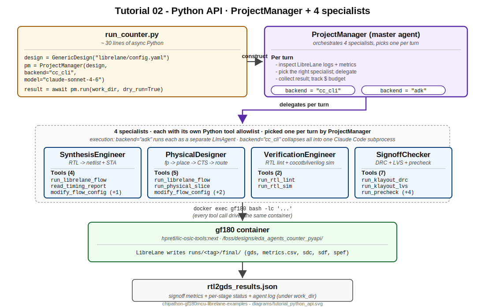

# Tutorial 02 — Counter via the eda-agents Python API

> **EXPERIMENTAL.** Programmatic agent invocation via the `eda-agents` Python API. Not part of the chipathon tapeout signoff path. For tapeout work stay with `examples/`.



Same 4-bit counter as Tutorial 01, but driven from Python instead of a chat session. Useful when you want to script the agent into a CI pipeline, a benchmark sweep, or a cron job.

## Files

```
02_counter_python_api/
├── 02_counter_python_api.ipynb        # orchestrator notebook
├── README.md                           # this file
├── run_counter.py                      # headless twin of the notebook
├── rtl/
│   └── counter.v                       # same 4-bit counter as T01 / T03
├── tb/
│   ├── Makefile                        # cocotb dispatcher
│   ├── Makefile.cocotb                 # standard cocotb include
│   └── test_counter.py                 # 3 cocotb tests
└── librelane/
    └── config.yaml                     # GF180MCU Classic flow config (same as T01)
```

## What this tutorial demonstrates

- **`GenericDesign`**. The config-driven `DigitalDesign` adapter. Pass it a `config.yaml` path and it auto-derives all 13 methods (`project_name`, `verilog_files`, `clock_port`, `clock_period`, etc.) — no Python subclass needed for a basic flow.
- **`ProjectManager`**. The master agent. Orchestrates four specialists (Synthesis, Physical, Verification, Signoff) each with their own tool allowlist. The Manager picks which specialist to call at each turn based on the current state.
- **`backend="cc_cli"` vs `backend="adk"`**. Two completely different execution paths for the same agent definition. cc_cli runs the agent as a Claude Code subprocess (uses your `~/.claude/` subscription, no env var); adk runs it as a Google ADK `LlmAgent` (needs `OPENROUTER_API_KEY` or similar).
- **Dry-run**. `pm.run(work_dir, dry_run=True)` constructs the agent graph, builds the system prompt, prints either the prompt length (cc_cli) or the sub-agent topology (adk), but makes no LLM call. Free, ~5 seconds. Useful for verifying setup before spending budget.

## Running the example

### Notebook (recommended for first pass)

```bash
jupyter lab tutorials/02_counter_python_api/02_counter_python_api.ipynb
```

Step through cells 0-4 to see the dry-run output. Then flip `RUN_REAL=True` in cell 0 and run cells 5-6 for the full flow + metrics check.

### Headless script (recommended for CI / scripting)

```bash
# Activate the venv that has eda-agents installed.
source ~/personal_exp/eda-agents/.venv/bin/activate

# Default mode is dry-run, ~5 seconds:
python tutorials/02_counter_python_api/run_counter.py --no-pause

# For the real run with cc_cli backend, edit the script:
#   RUN_REAL=True
#   RUN_DANGEROUSLY=True   # cc_cli needs --dangerously-skip-permissions in subprocess mode
# AND export the env gate:
export EDA_AGENTS_ALLOW_DANGEROUS=1

python tutorials/02_counter_python_api/run_counter.py --no-pause
```

**Why the dangerous flag?** With `BACKEND="cc_cli"`, the agent runs as `claude --print` in a non-interactive subprocess. Each tool call (docker exec, file read, etc.) hits Claude Code's permission layer; with no human to approve, the agent refuses or hangs. `--dangerously-skip-permissions` lets it proceed. The flag is double-gated (constructor arg + env var) so you cannot trip it accidentally. With `BACKEND="adk"` the gate is irrelevant — ADK has its own tool plumbing.

The script and notebook share the same logic; pick whichever fits your workflow.

## Step-by-step runtime estimate

| Step | Time | What runs |
|------|------|-----------|
| 0 (config + path guard) | <1s | pure Python |
| 1 (pip install, optional) | 30-60s | only if `eda_agents` is not yet installed |
| 2 (pre-flight) | ~2s | `docker ps`, `import`, `which claude` |
| 3 (stage workspace) | <1s | `shutil.copytree` x3 |
| 4 (dry-run) | ~5s | constructs `GenericDesign` + `ProjectManager`, no LLM |
| 5 (real run) | 5-15 min | LibreLane (~2 min on this counter) + agent reasoning turns |
| 6 (metrics check) | <1s | parse `librelane/runs/<tag>/final/metrics.csv` |

**Total: 6-17 minutes** for a successful real run (LibreLane validated at 2 min on this host); ~5 seconds for dry-run only.

## Expected output

### Dry-run (cc_cli backend)

```
design          : counter
specs           : WNS >= 0 at all corners, DRC clean, LVS match
FoM             : FoM = 1.0 * WNS_worst_ns + 0.5 * (1e6/die_area_um2) + 0.3 * (1/power_W). Higher is better. Returns 0.0 for designs that fail timing.
backend         : cc_cli
model           : claude-sonnet-4-6
prompt length   : ~7500 chars
```

The model defaults to `claude-sonnet-4-6` for `BACKEND="cc_cli"` because Claude Code only accepts Anthropic model IDs — passing a Google or OpenRouter ID returns API 404. Override via `EDA_AGENTS_MODEL=claude-haiku-4-5` (cheaper, still capable for this tiny design) or `claude-opus-4-7` (overkill).

### Dry-run (adk backend)

```
design          : counter
backend         : adk
master          : ProjectManager
sub-agents      : SynthesisEngineer, PhysicalDesigner, VerificationEngineer, SignoffChecker
```

### Real run (Step 5 result + Step 6 metrics check)

Validated 2026-04-25 against this exact config + RTL (LibreLane v3, GF180MCU, `BACKEND="cc_cli"`, `LLM_MODEL="claude-sonnet-4-6"`):

**Agent verdict** (`rtl2gds_results.json`):

```
verdict     : SIGNOFF_CLEAN
num_turns   : 47
duration_ms : 755917   (~12.6 min wall time)
cost_usd    : 0.99
done        : true
```

The agent's prose summary inside `result_text` reports the per-corner timing table and the DRC / LVS verdict (signoff at all 9 PVT corners, Magic DRC = 0, KLayout DRC skipped per PDK config).

**LibreLane signoff** (Step 6, `librelane/runs/<tag>/final/metrics.csv`, validated by direct CLI run):

```
  design__instance__count__stdcell              704
  timing__setup_vio__count                       0
  timing__hold_vio__count                        0
  magic__drc_error__count                        0
  klayout__drc_error__count                      (missing -- KLayout.DRC: null in config)
  design__lvs_error__count                       0
  route__drc_errors                              0
  power__total                                   0.000384

PASS: all hard-zero signoff metrics are 0.
```

The 704-cell count is mostly clock tree buffers + filler/decap cells filling the 300x300 um die at 4.6% utilization (the raw counter is 4 flops). KLayout DRC reports as missing because the GF180MCU LibreLane install ships no KLayout DRC runset; the config explicitly substitutes `KLayout.DRC: null` so the step is skipped. Magic DRC at 0 is the authoritative DRC for this PDK.

## Backend comparison

| Backend | Cost per run (counter) | Latency per turn | Setup |
|---------|------------------------|------------------|-------|
| `cc_cli` + Claude Sonnet 4.6 (validated) | $0.99 (subscription quota) | 5-15 seconds | `claude` CLI on PATH |
| `cc_cli` + Claude Haiku 4.5 (estimated) | ~$0.20-0.40 | 3-8 seconds | `claude` CLI on PATH |
| `adk` + `google/gemini-3-flash-preview` | ~$0.005-0.02 | 2-5 seconds | `OPENROUTER_API_KEY` |
| `adk` + `anthropic/claude-haiku-4-5` | ~$0.05-0.15 | 3-8 seconds | `OPENROUTER_API_KEY` |
| `adk` + `anthropic/claude-opus-4-7` | ~$1-3 | 10-30 seconds | `OPENROUTER_API_KEY` |

**Note on cc_cli + subscription cost:** Anthropic's published Claude Code subscription plans absorb token spend up to fair-use limits. The "$0.99" above is the cost the Claude API would have charged for the same conversation; it does not appear on your subscription bill unless you've blown through your monthly cap. If you want zero subscription burn, switch to Claude Haiku 4.5 (`EDA_AGENTS_MODEL=claude-haiku-4-5`) or use a paid OpenRouter key with `BACKEND="adk"`.

For this counter, Gemini Flash via adk gets the right answer almost as reliably as Sonnet, at 1% of the cost. For more complex designs (CPUs, multi-macro flows) the cost-vs-success-rate picture changes.

## Prerequisites

- `gf180` container running.
- `eda-agents` pip-installed with `[adk]` extra in an active venv.
- One of: `claude` CLI on PATH, **or** `OPENROUTER_API_KEY` (or `GOOGLE_API_KEY`) in your environment.
- `EDA_AGENTS_ROOT` env var pointing at your local `eda-agents` clone (default: `~/personal_exp/eda-agents`). Only needed for the `RUN_PIP_INSTALL` cell.

## What can go wrong

- **`ModuleNotFoundError: eda_agents`.** Your venv is not activated. `source <venv>/bin/activate` and retry. As a fallback, flip `RUN_PIP_INSTALL=True` in cell 0 and re-run the notebook.
- **`claude: command not found`** with `BACKEND="cc_cli"`. Either install Claude Code (`npm install -g @anthropic-ai/claude-code`) or switch `BACKEND="adk"` and set `OPENROUTER_API_KEY`.
- **`401 Unauthorized`** with `BACKEND="adk"`. The active environment does not see the API key. Check with `echo $OPENROUTER_API_KEY` in the same shell that launched Jupyter.
- **`ProjectManager.__init__()` raises with an unknown backend**. Only `"cc_cli"` and `"adk"` are supported by `ProjectManager` today. Tutorial 03 (autoresearch) supports `"opencode"` and `"litellm"` additionally.

## Cleanup

```bash
rm -rf ~/eda/designs/eda_agents_counter_pyapi/
rm -rf tutorials/02_counter_python_api/rtl2gds_counter_pyapi_results/
```

## Next

[`../03_counter_autoresearch/`](../03_counter_autoresearch/) — instead of one agent run, a greedy loop iterates the agent over QoR config knobs.
