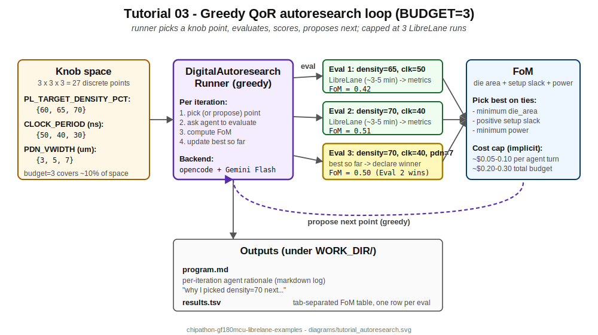

# Tutorial 03 — Counter QoR autoresearch

> **EXPERIMENTAL.** Greedy AI loop that pareto-optimises QoR knobs on the same 4-bit counter from Tutorials 01-02. **Costs real money.** Capped at ~$0.30 by default with opencode + Gemini Flash. Not part of the chipathon tapeout signoff path.



Tutorial 02 ran the agent **once** with a fixed config. This tutorial runs the agent **multiple times** while sweeping a discrete knob space, picking the best result by FoM. Use it to understand how AI-driven QoR exploration works at a small scale before pointing it at a real design.

## Files

```
03_counter_autoresearch/
├── 03_counter_autoresearch.ipynb       # orchestrator notebook
├── README.md                            # this file
├── run_autoresearch.py                  # headless twin
├── rtl/
│   └── counter.v                        # same 4-bit counter as T01 / T02
└── librelane/
    └── config.yaml                      # GF180MCU Classic flow config
```

(No `tb/` because autoresearch focuses on physical-flow QoR, not functional verification. Run cocotb manually if you want a sanity check.)

## What this tutorial demonstrates

- **`DigitalAutoresearchRunner`**. A greedy optimiser over a discrete knob space. Picks a starting point, evaluates via the agent, scores by FoM, proposes a neighbouring point, repeats until budget is exhausted.
- **Knob space**. By default: `PL_TARGET_DENSITY_PCT` × `CLOCK_PERIOD` × `PDN_VWIDTH`. 27 total points in a 3×3×3 grid; 3 evaluations cover ~10% of the space.
- **FoM**. Combined die area + setup slack + power. The runner picks the best by FoM after the budget exhausts; you can tail `results.tsv` to see the full search trace.
- **Cost capping**. Each iteration is one LibreLane run (~3-5 minutes) plus one agent decision turn (~$0.05-0.10 with Gemini Flash). With `BUDGET=3`, total spend is ~$0.20-0.30.
- **Transparency**. `program.md` accumulates the agent's rationale per turn. Read it to understand *why* the agent chose each point.

## Running the example

### Notebook

```bash
jupyter lab tutorials/03_counter_autoresearch/03_counter_autoresearch.ipynb
```

Step through cells 0-4 for the dry-run. Then flip `RUN_REAL=True, RUN_INSPECT=True` in cell 0 and run cells 5-6 for the real loop.

### Headless

```bash
source ~/personal_exp/eda-agents/.venv/bin/activate
python tutorials/03_counter_autoresearch/run_autoresearch.py --no-pause
# Edit script: RUN_REAL=True at the top, then re-run.
```

## Step-by-step runtime estimate

| Step | Time | Cost | What runs |
|------|------|------|-----------|
| 0 (config + path guard) | <1s | $0 | pure Python |
| 1 (pip install, optional) | 30-60s | $0 | only if not yet installed |
| 2 (pre-flight) | ~2s | $0 | `docker ps`, `import`, `which opencode` |
| 3 (stage workspace) | <1s | $0 | `shutil.copytree` x2 |
| 4 (dry-run) | ~5s | $0 | construct runner, print knob/FoM |
| 5 (real run) | 10-15 min | ~$0.20-0.30 | 3x LibreLane + 3x agent turns |
| 6 (inspect logs) | <1s | $0 | tail program.md + results.tsv |

**Total: 11-17 minutes, ~$0.20-0.30** for a successful real run; ~5 seconds for dry-run only.

## Expected output

### Dry-run

```
  design  : counter
  specs   : 4-bit synchronous up-counter on GF180MCU at 50ns clock
  FoM     : die area + setup slack + power
  budget  : 3 LibreLane evaluations
  knobs   : PL_TARGET_DENSITY_PCT x CLOCK_PERIOD x PDN_VWIDTH
  backend : opencode
  model   : openrouter/google/gemini-3-flash-preview
  WORK_DIR: ./digital_autoresearch_results
```

### Real run, after RUN_INSPECT=True

`program.md` (excerpt):

```markdown
# Autoresearch on counter @ gf180mcu

## Iteration 1
Picked starting point: density=65, clock=50ns, pdn_vwidth=5.
Rationale: middle of the knob space, conservative power baseline.
LibreLane outcome: die_area=90000 um2, setup_slack=+12.3ns, power=4.8e-5W.
FoM: 0.42

## Iteration 2
Picked density=70, clock=40ns, pdn_vwidth=5.
Rationale: tighter density to shrink area; tighter clock to push timing.
LibreLane outcome: die_area=82000 um2, setup_slack=+5.1ns, power=5.5e-5W.
FoM: 0.51

## Iteration 3
[...]

## Best
density=70, clock=40ns, pdn_vwidth=5: FoM=0.51
```

`results.tsv` (excerpt):

```
density  clock  pdn_vwidth  die_area  setup_slack  power      fom
65       50     5           90000     12.3         4.8e-5     0.42
70       40     5           82000     5.1          5.5e-5     0.51
70       40     7           82500     5.0          5.6e-5     0.50
```

## Backend comparison for autoresearch

| Backend | Cost / eval | Setup | Notes |
|---------|-------------|-------|-------|
| `opencode` + Gemini Flash | ~$0.05-0.10 | opencode CLI + OPENROUTER_API_KEY | **Recommended.** Cheap, multi-provider, opencode handles agent context efficiently. |
| `cc_cli` | $0 (subscription) | Claude Code CLI | Subscription is unlimited at fair-use; great if you have Claude Pro/Max. |
| `adk` + Gemini | ~$0.05-0.10 | OPENROUTER_API_KEY or GOOGLE_API_KEY | Slower turns than opencode. |
| `litellm` + any | varies | provider key | Direct LLM call, no agent runtime. |

## Prerequisites

- `gf180` container running.
- `eda-agents` pip-installed with `[adk]` extra in an active venv.
- For `BACKEND="opencode"` (default): opencode CLI on PATH (`npm install -g opencode-ai`) + `OPENROUTER_API_KEY`.
- For `BACKEND="cc_cli"`: `claude` CLI on PATH + Claude subscription.
- `EDA_AGENTS_ROOT` env var pointing at your local clone (default: `~/personal_exp/eda-agents`).

## What can go wrong

- **`ModuleNotFoundError: eda_agents.agents.digital_autoresearch`** — older `eda-agents` install. Pull latest, then `pip install -e <eda-agents>[adk]` again.
- **`opencode: command not found`** — `npm install -g opencode-ai`. Verify with `opencode --version`.
- **`401 Unauthorized` on first agent turn** — `OPENROUTER_API_KEY` not visible to the shell that launched Jupyter. Check `echo $OPENROUTER_API_KEY` in the notebook (`!echo $OPENROUTER_API_KEY` from a code cell).
- **LibreLane fails on iteration 2 with "no space left on device"** — runs accumulate. Add `RUN_CLEAN_BETWEEN=True` (not implemented yet; manual cleanup: `rm -rf ~/eda/designs/eda_agents_counter_autoresearch/runs/*` between iterations).
- **Cost overruns** — `BUDGET=3` is approximate cost cap, not a hard $ limit. If a single agent turn loops on retries, costs can spike. Monitor with `tail -f program.md` during the real run.

## Cleanup

```bash
rm -rf ~/eda/designs/eda_agents_counter_autoresearch/
rm -rf tutorials/03_counter_autoresearch/digital_autoresearch_results/
```

## Going further

- **More knobs.** Edit `eda_agents/agents/digital_autoresearch.py` to add knobs. The runner will treat the new dimension transparently.
- **Bigger designs.** The runner accepts any `DigitalDesign`. Point it at `examples/04_counter_alu_multimacro/` (multi-macro chip-top) and it will run the full multi-macro flow per iteration. **Cost: $5-10** for a budget of 3 on that bigger flow — be aware.
- **Different FoM.** Subclass `DigitalAutoresearchRunner` and override the FoM. Useful if you care about, say, leakage power dominance over dynamic, or wire-length specifically.
